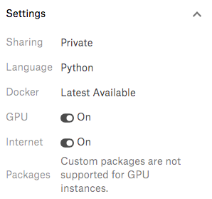
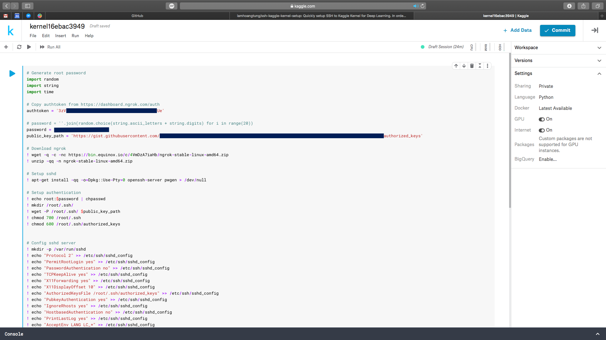
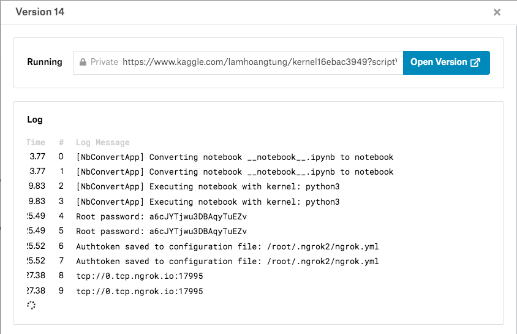
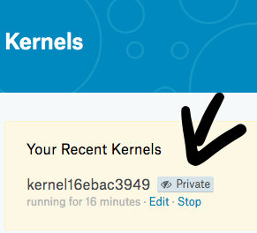

# SSH Kaggle Kernel Setup :rocket:
Quick script to setup SSH to Kaggle Kernel for Deep Learning. In order to use that sexy P100 for free (and without many restriction of Jupyter Notebook) :P

## Preparation
1. Go to https://dashboard.ngrok.com/auth and get your authentication token after register with Google or Github (You only have to do this once)
2. Modify the [get_ssh.py](./get_ssh.py) file:
    1. Replace your `ngrok` authentication token at line `7` in 
    2. Set a password for your user at line `10` (just in case you need it, we will use SSH Key authentication from now on)
    3. Create a public [Github Gist](https://gist.github.com) with file name `authorized_keys` and paste your **public SSH key** (usually located at `~/.ssh/id_rsa`) as the content of the gist. 
    4. If you don't have an SSH key (RSA Key Pair), please refer to the first step in [this article](https://www.digitalocean.com/community/tutorials/how-to-set-up-ssh-keys-on-ubuntu-1804)
    4. Replace **the link to raw content of your gist** at line `11`

## **How to setup SSH connection**


- **Step 1:** Create a [new Kaggle kernel](https://www.kaggle.com/kernels) 

- **Step 2:** Go to Kernel Settings and turn on `GPU` and `Internet`

    

- **Step 3:** Copy the whole content of the modified [get_ssh.py](./get_ssh.py) and paste to the kernel as the first block of code.

    

- **Step 4:** Click `Commit` on the top right conner and wait a minutes for everything to set up. You should see a pop-up windows like this:

    

    Save the host address information `tcp://0.tcp.ngrok.io:16360` to SSH. If some how you forget the host address and port, go to `your Ngrok Dashboard -> Status` and you will found them again.

## **How to SSH**    
- `ssh root@0.tcp.ngrok.io -p 16360` <-- port number dictated in above output
- With root password also dictated in above output
- You won't have to use the password since we already used SSH key authentication to logging into your server
- You can turn off the browser, disconnect from the server and it will still running. But keep in mind this server can only live for ***9 hours*** at max.

## **How to quickly setup the server**
- Kaggle Kernel already provide many Machine Learning and Deep Learning package and library ready to use with a powerful **NVIDIA Tesla P100 GPU** so you might be good to go. But if you want something more that I usually use. Run this to get more:
    ```bash
    cd ~
    wget https://github.com/lamhoangtung/kaggle-kernel-setup/raw/master/install_common.sh
    chmod 777 install_common.sh
    ./install_common.sh
    ```
    And follow the instruction.

- You only need to `Commit` again in the same kernel to get everything up and running again after terminate the server. `Host address` information will be reset each time you commit.
- You will need multiple `Kaggle` account and multiple `ngrok` account to get multiple server running at the same time.

## **How to terminate the server**
- Go to https://www.kaggle.com/kernels and look at the `Your Recent Kernels` section and hit `Stop`.

    
- If you encounter any problem while setting up the connection. Please terminate the server as above. Then open the kernel in editor mode and go to `Run > Power off`, then turn it on manually.

    
- Keep in mind everything will be lost (including process and files, ...) when you `Power off` or `Terminate` the kernel

### **Feels free to contribute to this tiny repo since I don't have much experience with bash and linux ;). All Pull Request are welcomed :heart:**
