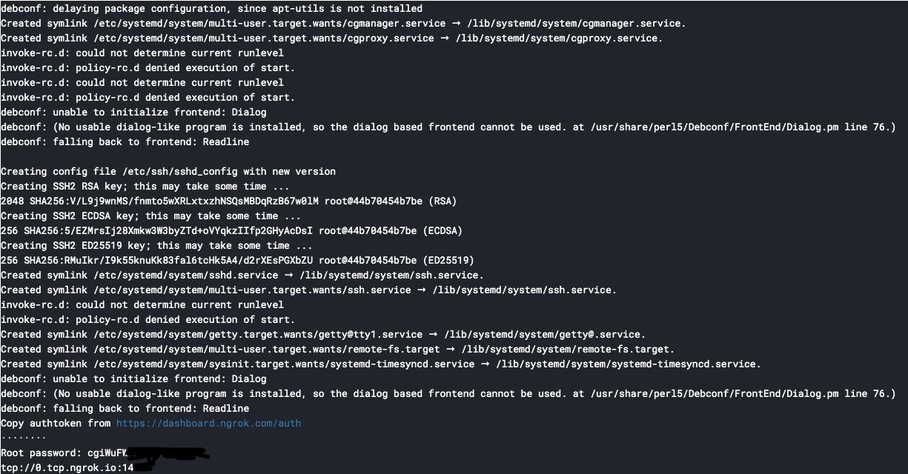

# SSH Kaggle Kernel Setup :rocket:
Quick script to setup SSH to Kaggle Kernel for Deep Learning. In order to use that sexy P100 for free :P

## How setup SSH connection
- **Step 1:** Create a [new Kaggle kernel](https://www.kaggle.com/kernels) 

- **Step 2:** Go to Kernel Settings and turn on `GPU` and `Internet`

    

- **Step 3:** 
    - Run all the code inside [`get_ssh.py`](./get_ssh.py) as a block code inside the Kernel. 
    - Copy authentication token after authenticating your ID using google or github on `ngrok` website

    You should see something like this:

    

### **How to SSH**    
- `ssh root@0.tcp.ngrok.io -p 10965` <-- port number dictated in above output
- With root password also dictated in above output
- Keep in mind this server can only live for ***9 hours*** at max.

## How to quickly setup this server
Kaggle Kernel already provide many Machine Learning and Deep Learning package and library ready to use with a powerful **NVIDIA Tesla P100 GPU** so you might be good to go. But if you want something more that I usually use. Run this to get more:
```bash
cd ~
wget https://github.com/lamhoangtung/kaggle-kernel-setup/raw/master/install_common.sh
chmod 777 install_common.sh
./install_common.sh
```
And follow the instruction.

### **Feels free to contribute to this tiny repo since I don't have much experience with bash and linux ;). All Pull Request are welcomed :heart:**
